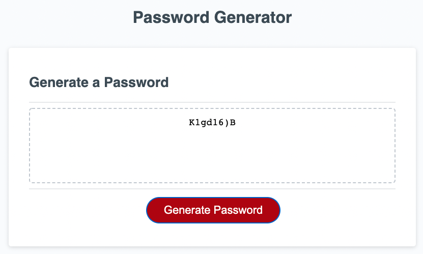

# Weekly Challenge 3 - Password Generator

## Table of Contents

-[Screenshot](#ScreenShot)
-[Description](#Description)
-[Links](#Links)

## Screenshot 

## Description 

Challenge was to write the function that would generate a password based on different criteria confirmed by the user using javascript. CSS & HTML pages were provided for this challenge. Inputs from user needed to be validated before generating and returning a random password. 

## Links 

[Site Link](https://michael-alvarado.github.io/Password-Generator/)
[Repository Link](https://github.com/Michael-Alvarado/Password-Generator)
